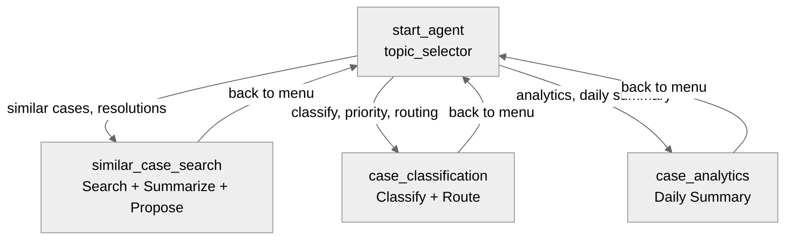

# Agent Spec: CaseIntelligenceAgent

## Purpose & Scope

Internal employee agent for JPMorgan Chase service agents. Assists case workers in Service Console with finding similar resolved cases via Data 360 vector search, classifying incoming cases with ML-driven analysis, and pulling daily analytics summaries for supervisors. This agent does NOT fabricate data — all case intelligence comes from action results.

## Behavioral Intent

- **Data fidelity:** ALWAYS use Search_Similar_Cases to find matches. NEVER fabricate resolution patterns from training data. Action results are the sole source of truth.
- **Backing logic:** All Apex-backed except Route_To_Specialist (Flow). Apex classes exist as stubs returning realistic mock data.
- **Guardrails:** Scope limited to case intelligence (search, classify, analytics). Off-scope requests are deflected politely.
- **State:** Variables capture action results for cross-action chaining (search results → summarize → propose).
- **Employee agent:** Runs as logged-in user. No `default_agent_user`, no messaging channel, no escalation.

## Topic Map

## Variables

- `search_results` (mutable string = "") — JSON results from similar case search. Set by: search_similar_cases. Read by: similar_case_search topic for display.
- `resolution_summary` (mutable string = "") — Summarized patterns from matched cases. Set by: summarize_resolution. Read by: propose_resolution as input.
- `proposed_resolution` (mutable string = "") — Step-by-step proposed resolution. Set by: propose_resolution.
- `classification_result` (mutable string = "") — Full JSON classification (reason, sentiment, priority, routing). Set by: classify_case. Read by: route_to_specialist as input.
- `routing_result` (mutable string = "") — Routing operation status. Set by: route_to_specialist.
- `analytics_summary` (mutable string = "") — Daily case summary data. Set by: daily_case_summary.

## Actions & Backing Logic

### Search_Similar_Cases (similar_case_search topic)

- **Target:** `apex://CaseIntelligenceSearchSimilarCases`
- **Backing Status:** EXISTS (stub with realistic mock data)

#### Inputs

| Name | Type | Required | Source |
|------|------|----------|--------|
| subject | string | Yes | User input (LLM slot-fill) |
| case_description | string | Yes | User input (LLM slot-fill) |
| product_category | string | No | User input (LLM slot-fill) |
| account_type | string | No | User input (LLM slot-fill) |

#### Outputs

| Name | Type | Visible to User? | Notes |
|------|------|-------------------|-------|
| result | string | Yes | JSON array of top 5 similar resolved cases |

### Summarize_Resolution (similar_case_search topic)

- **Target:** `apex://CaseIntelligenceSummarizeResolution`
- **Backing Status:** EXISTS (stub)

#### Inputs

| Name | Type | Required | Source |
|------|------|----------|--------|
| case_ids | string | Yes | LLM slot-fill from search results |

#### Outputs

| Name | Type | Visible to User? | Notes |
|------|------|-------------------|-------|
| result | string | Yes | Summary of resolution patterns |

### Propose_Resolution (similar_case_search topic)

- **Target:** `apex://CaseIntelligenceProposeResolution`
- **Backing Status:** EXISTS (stub)

#### Inputs

| Name | Type | Required | Source |
|------|------|----------|--------|
| case_id | string | Yes | LLM slot-fill |
| pattern_summary | string | Yes | Variable binding from resolution_summary |

#### Outputs

| Name | Type | Visible to User? | Notes |
|------|------|-------------------|-------|
| result | string | Yes | Step-by-step proposed resolution |

### Classify_Case (case_classification topic)

- **Target:** `apex://CaseIntelligenceClassifyCase`
- **Backing Status:** EXISTS (stub)

#### Inputs

| Name | Type | Required | Source |
|------|------|----------|--------|
| subject | string | Yes | LLM slot-fill |
| case_description | string | Yes | LLM slot-fill |
| account_tier | string | No | LLM slot-fill |

#### Outputs

| Name | Type | Visible to User? | Notes |
|------|------|-------------------|-------|
| reason | string | Yes | Classification reason/category |
| sentiment_score | string | Yes | Customer sentiment score |
| suggested_priority | string | Yes | Suggested priority level |
| routing_team | string | Yes | Recommended specialist team |

### Route_To_Specialist (case_classification topic)

- **Target:** `flow://Case_RouteToSpecialist`
- **Backing Status:** NEEDS STUB (Flow)

#### Inputs

| Name | Type | Required | Source |
|------|------|----------|--------|
| classification_json | string | Yes | Variable binding from classification_result |

#### Outputs

| Name | Type | Visible to User? | Notes |
|------|------|-------------------|-------|
| routing_status | string | Yes | Status of routing operation |

### Daily_Case_Summary (case_analytics topic)

- **Target:** `apex://CaseIntelligenceDailySummary`
- **Backing Status:** EXISTS (stub)

#### Inputs

| Name | Type | Required | Source |
|------|------|----------|--------|
| priority_filter | string | No | LLM slot-fill |

#### Outputs

| Name | Type | Visible to User? | Notes |
|------|------|-------------------|-------|
| result | string | Yes | Daily case summary analytics JSON |

## Gating Logic

No gating required. All actions are always available within their respective topics. The action chain in similar_case_search (search → summarize → propose) is controlled by LLM instructions rather than `available when` gates, since the LLM needs flexibility to re-run searches or skip steps.

## Architecture Pattern

**Hub-and-Spoke.** `start_agent topic_selector` is the hub, routing to 3 domain topics (similar_case_search, case_classification, case_analytics). Each spoke has a "back to menu" transition. No verification gate needed (employee agent — identity handled by Salesforce login).

## Agent Configuration

- **developer_name:** `CaseIntelligenceAgent`
- **agent_label:** `Case Intelligence Agent`
- **agent_type:** `AgentforceEmployeeAgent` — internal tool for service agents, accessed via Service Console
- **default_agent_user:** N/A — employee agent (runs as logged-in user)
